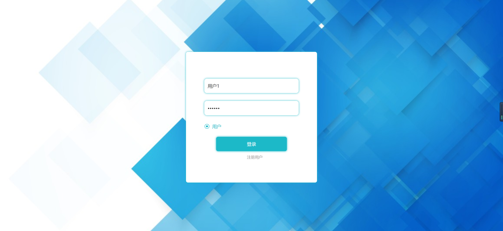
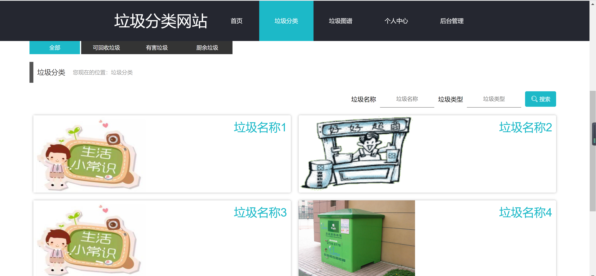
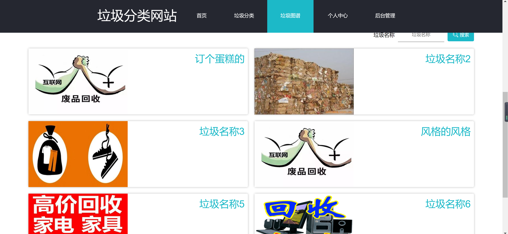
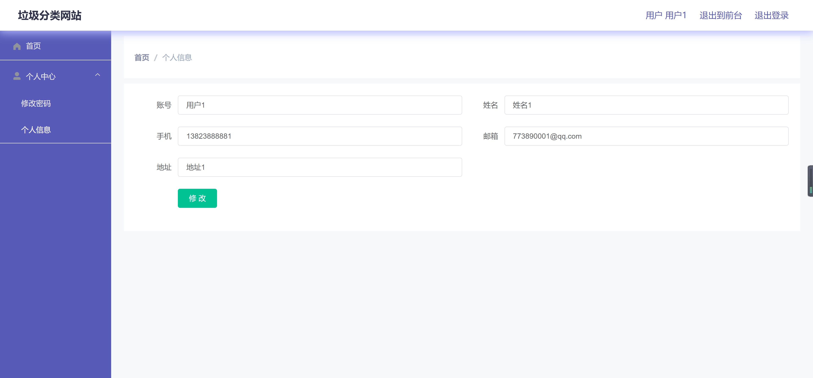
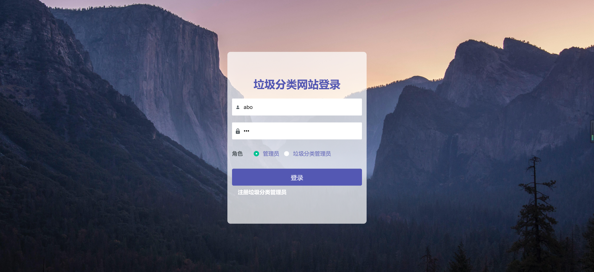
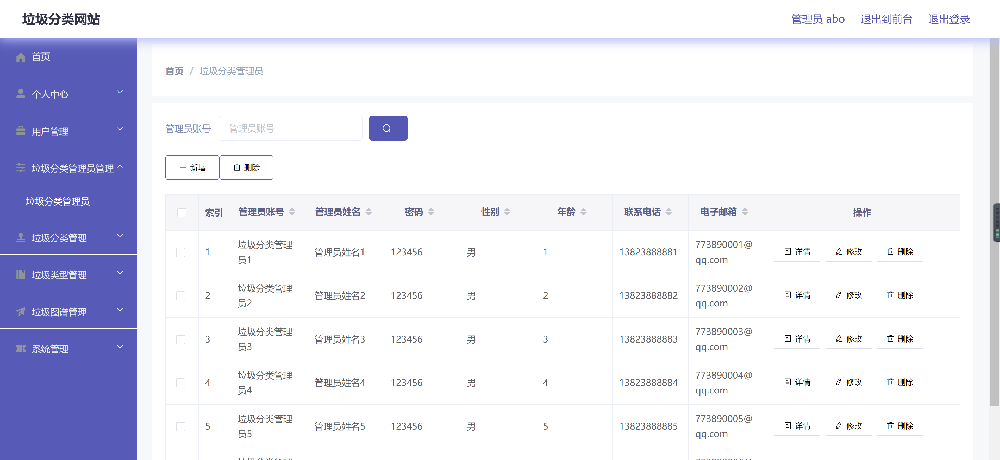
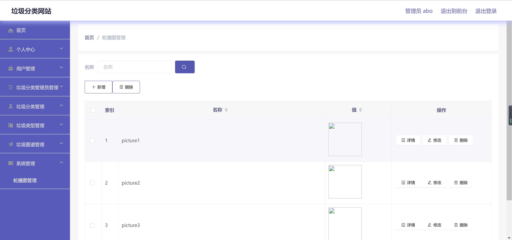

<h1 align="center">垃圾分类网站管理系统</h1>

## 简介
垃圾分类网站管理系统：包含角色管理、垃圾分类、个人信息维护、用户及图谱管理，支持登录注册及详细数据操作。    --计算机毕业设计源码；毕设源码；java毕业设计源码

## 联系方式

<h3 align="center">获取完整代码与数据库文件 + 微信：deepguan QQ: 86050149 QQ群: 783742310</h3>

<h3 align="center">可帮忙远程部署 包运行成功！提供远程部署、修改代码、设计文档指导、代码讲解等服务！</h3>

## 功能介绍（完整见运行截图）
管理员：基本功能包括登录、注册、退出等。系统提供完善的账户管理功能，管理员能够新增、删除、修改用户和垃圾分类管理员的账户信息。通过网站首页，管理员可以访问主要导航栏及系统管理的各模块，如用户管理、垃圾分类管理、垃圾类型管理和轮播图管理。管理员界面包含垃圾分类相关数据和资源的全面管理功能，如新增、删除和查看详细信息等操作。

垃圾分类管理员：登录系统后可以通过个人中心修改密码和更新个人信息。该角色主要负责管理垃圾分类信息，包括垃圾类别展示、垃圾图谱管理等。垃圾分类管理员可以借助系统提供的工具进行垃圾数据的录入与编辑，以确保分类信息的准确性和完整性，还有角色专属的注册入口，便于新增认证账户。

普通用户：可以通过简单的注册和登录流程进入系统，从首页开始，用户可以使用导航栏访问垃圾分类、垃圾图谱、个人中心等模块。用户个人中心提供信息查看与更新功能，快速查询与修改个人信息，如联系方式和地址。系统通过图文结合的方式展示各类垃圾名称与图片，并提供搜索功能，便利用户查看垃圾分类信息。

游客：作为未注册的用户，游客能够浏览网站的部分公开信息，如垃圾类别展示和相关分类说明。游客可以通过注册功能快速成为普通用户以获取更多权限，增加交互体验。游客模式为未注册用户提供了基本的浏览权限，了解系统功能及信息布局，并通过系统界面对垃圾分类网站形成初步认识。

## 运行截图

本代码来源于网络,仅供学习参考使用!

